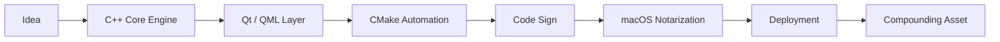
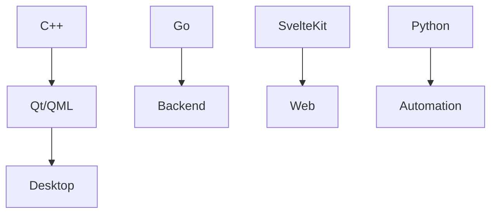
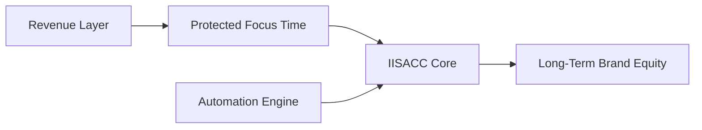
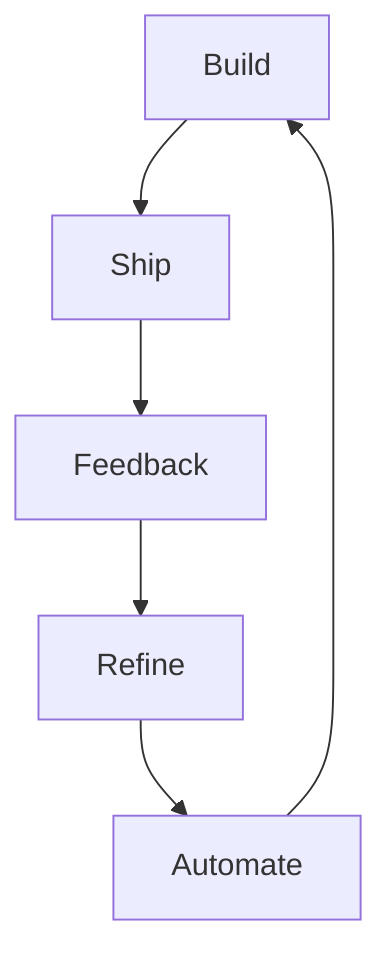

# JUSTMOONG

 

 

 

---

## ⚙ System Architecture

---

## 🧠 Stack Matrix

---

## 📈 Execution Model

---

## 🚀 Capability Surface

---

## 🔄 Compounding Momentum

---

### Independent Software

### Independent Structure

### Independent Momentum

https://iisacc.com

